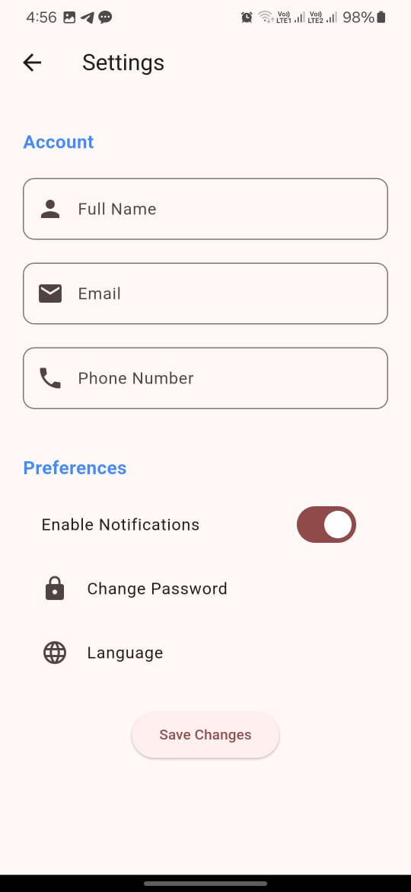

# Notify

Notify is a Flutter application designed to help users create and manage notes with ease and style. The project focuses on providing a seamless user experience with a clean and attractive UI.

## Features

- **Add Notes**: Easily create new notes.
- **Edit Notes**: Modify note content and colors to suit your preferences.
- **Attractive UI**: Sleek and simple design for easy navigation.
- **Profile Screen**: A personalized screen to display user information.
- **Home Screen**: A dashboard displaying all your notes in an organized and visually appealing layout.

## Project Architecture

The project follows the **Model-View-Controller (MVC)** architecture:

- **Model**: Handles the data layer and business logic. Uses Hive for local data storage.
- **View**: Responsible for the UI components and presenting data to the user.
- **Controller**: Manages the interaction between the Model and the View, ensuring smooth functionality.

## State Management

The project uses **Cubit** for state management:

- **Cubit**: A lightweight state management solution that is part of the Bloc library. It helps manage the state of the application in a predictable way.

## Technologies Used

- **Flutter**: For building the user interface
- **Dart**: The core programming language
- **Hive**: A local database for storing notes
- **Figma**: For UI/UX design
- **Cubit**: For state management

## App Design

Check out the complete app design:   
[View Design on Figma](https://www.figma.com/design/rVyIml5y6m3W11At6xVwNZ/Notes-App-(Community)?m=auto&t=bQFqtKLK45Jf07vn-6)

## Getting Started

### Prerequisites

- **Flutter SDK**: Ensure you have the latest version installed. [Installation Guide](https://flutter.dev/docs/get-started/install)
- **Dart SDK**: Comes bundled with Flutter
- **IDE**: Use an IDE like Visual Studio Code or Android Studio

### Installation Steps

1. **Clone the Repository**:
   ```sh
   git clone https://github.com/omarAbdullahMoharam/Notify.git
   cd Notify
   ```

2. **Install Dependencies**:
   ```sh
   flutter pub get
   ```

3. **Run the Application**:
   ```sh
   flutter run
   ```

## Screenshots

<table>
<tr>
<td><br/>Splash Screen</td>
<td><br/>Welcome Screen</td>
<td><br/>Home Screen</td>
<td><br/>Add Note Screen</td>
<td><br/>Edit Note Screen</td>
</tr>
<tr>
<td><br/>Profile Screen</td>
<td><br/>Account Screen</td>
<td><br/>Settings Screen</td>
<td><br/>Help Screen</td>
</tr>
</table>

## Contribution

Contributions are welcome! To contribute:

1. **Fork the Repository**
2. **Create a New Branch**:
   ```sh
   git checkout -b feature/YourFeature
   ```

3. **Commit Your Changes**:
   ```sh
   git commit -m 'Add YourFeature'
   ```

4. **Push to GitHub**:
   ```sh
   git push origin feature/YourFeature
   ```

5. **Open a Pull Request** for review

## About the Project

This project was developed entirely by me without following any specific course. It reflects my personal approach to design and development, aiming for clean code and a user-friendly experience.

## License

This project is licensed under the **MIT License**. See the LICENSE file for more details.
